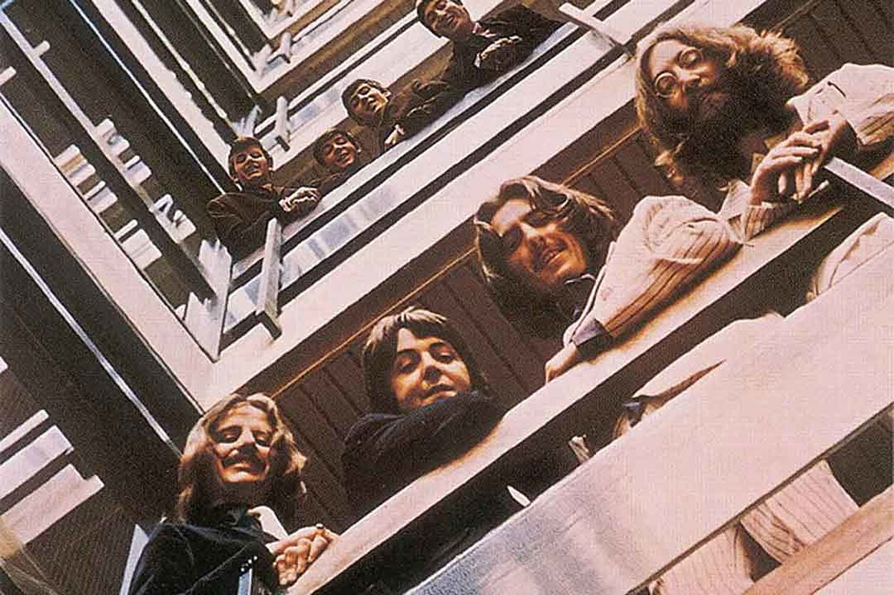
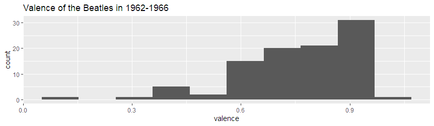
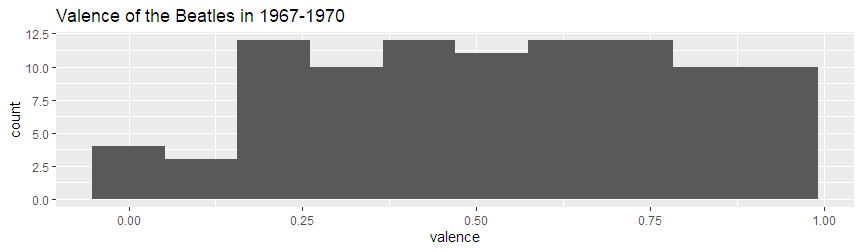
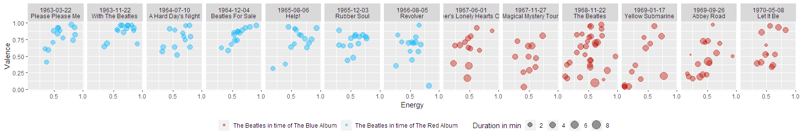

# Computational-Musicology
In 1973, three years after the break-up of the Beatles, two compilation albums were released: The Red Album and The Blue Album. The red album contains a collection of the best songs of the 7 albums made between 1962-1966. The blue album contains a collection of the best songs from the 6 albums released between 1967-1970.

An interesting question is, why decided Apple Records to split up the songs in two compilation albums instead of releasing one all-embracing album. According to Mark Steffen[1], the lifetime of the Beatles can be divided into different phases. He calls the time of The Red Album a phase where the songs were "dance songs whose themes were girls and falling in love." After this phase the Beatles changed, they only wrote songs in the studio, became more individualistic and they grew their hair. The songs in time of The blue Album had a different theme and sound as the group explored many new forms of music. The most famous example is the adding of a sitar in their song.

That the Beatles changed during their lifetime is clear, but was 1967 a clear turning point to split up the two compilation albums? Or is there a better point in time to divide their music?

When we look at the averaged features provided by Spotify, a few differences can be seen between the songs of the period before and after 1967. The mean energy in songs had a medium descend from 0.60 to 0.48. Also, the mean tempo descended a bit, from 125 to 118. However, the most interesting result is the descend from 0.76 to 0.53 of the valence. This is a measure describing the musical positiveness if a song, which means the music of the Beatles became a lot less positive.

Looking at the histograms of both periods, a histogram of the valence of the two periods can be seen. Where in the red phase, except for a few outliers, all the songs are more valence, the blue period is more equally spread out. 

For now, it seems like Apple Records made a good choice dividing the compilation album into two parts because the shape of the two plots looks different. The next question is, can we see a change in their music over time? In the next image is the energy of the music of The Beatles plotted against the valence per album. (Right-click and open the image in a new tab when you want to read the labels more clearly.)

In the plots, you can see The Beatles changed over time. They started as a band with high energy and valence, but in a few years, they evolved into a more diverse band with songs with high and low energy and high and low valence.

For now, it seems like Apple Records made a good choice dividing the compilation album into two parts. In further work, it would be interesting to look into the evolving of valence in time and to analyze if 1967 was the best splitting point when you look at Spotify's features.

### References
[1] Steffen, M. (1985). The Four Phases of the Beatles (1985).
