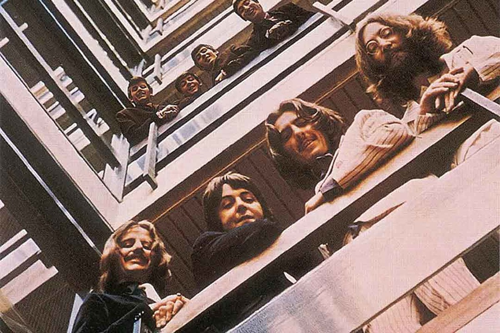

```{r setup}
# In order to use these packages, we need to install flexdashboard, plotly, and Cairo.
library(tidyverse)
library(plotly)
library(spotifyr)
library(stringr)
library(compmus)
source('spotify.R')
```
### A lot of repetition visible in the Come Together Self-Similarity

```{r}
# construct the Self-Similarity Matrices
CG_CT <- 
    get_tidy_audio_analysis('6lSxM9BKcEZBSDKl2VODsF') %>% 
    compmus_align(bars, segments) %>% 
    select(bars) %>% unnest(bars) %>% 
    mutate(pitches=map(segments, compmus_summarise, pitches, method = 'rms', norm = 'euclidean')) %>% 
    mutate(timbre=map(segments, compmus_summarise, timbre, method = 'mean'))

CG_CT %>% 
    compmus_self_similarity(timbre, 'cosine') %>% 
    ggplot(
        aes(
            x = xstart + xduration / 2, 
            width = xduration,
            y = ystart + yduration / 2,
            height = yduration,
            fill = d)) + 
    geom_tile() +
    coord_fixed() +
    scale_fill_viridis_c(option = 'E', guide = 'none') +
    theme_classic() +
    labs(x = '', y = '')
```

***

In the Self-Similarity Matrix, it is visible that Come Together is a structured song with a lot of repeating parts. Notice that the chorus of the song is fairly short, but repeats four times. Also, interesting to see is that at the same timestamp, the most used notes change in the chroma analysis.

The last interesting thing is that, like in the chroma analysis, the outro is clearly visible and repeats itself a lot.

### **The two phases of The Beatles** {data-commentary-width=1200}

In 1973, three years after the break-up of the Beatles, two compilation albums were released: 
<span style='color:red'><b>The Red Album</b></span> and <span style='color:blue'><b>The Blue Album</b></span>. The red album contains a collection of the best songs of the 7 albums made between 1962-1966. The blue album contains a collection of the best songs from the 6 albums released between 1967-1970.

An interesting question is, why decided Apple Records to split up the songs in two compilation albums instead of releasing one all-embracing album. According to Mark Steffen[1], the lifetime of the Beatles can be divided into different phases. He calls the time of The Red Album a phase where the songs were "dance songs whose themes were girls and falling in love." After this phase the Beatles changed, they only wrote songs in the studio, became more individualistic and they grew their hair. The songs in time of The blue Album had a different theme and sound as the group explored many new forms of music. The most famous example is the adding of a sitar in their song.

That the Beatles changed during their lifetime is clear, but was 1967 a clear turning point to split up the two compilation albums? Or is there a better point in time to divide their music?

***



### **Used playlists**

In this plot can be seen that in both almost the same number of songs were written. Hover to get the song and album information.
```{r}


# import albums
the_red_album <- get_playlist_audio_features('bobleynse', '0ghyYvT2B8me30mShW8pUB')
the_blue_album <- get_playlist_audio_features('bobleynse', '0UfoFrm53Q2G7kuQMjchvs')

# merge datasets
total1 <- rbind(the_red_album, the_blue_album)
total1$track.album.name <- str_sub(total1$track.album.name, 1, str_length(total1$track.album.name)-13)
total1$track.name <- str_sub(total1$track.name, 1, str_length(total1$track.name)-18)

datasets <- (
  ggplot(total1, aes(x=playlist_name, fill=track.album.name, size=track.name, text=paste("Album:", track.album.name, "\nSong:", track.name))) 
  + geom_bar()
  + theme(legend.position = "none", axis.text.x=element_blank(), axis.title.x=element_blank())
  + xlab("Playlist") + ylab("Number of songs")
  # + scale_fill_manual(values= c("#03b5fc", "#bf0d00", "#03b5fc", "#bf0d00", "#bf0d00", "#bf0d00", "#bf0d00", "#bf0d00", "#bf0d00", "#bf0d00", "#bf0d00", "#bf0d00", "#bf0d00")) 
  + facet_wrap(~playlist_name)
)
ggplotly(datasets, tooltip = c("text"))


```

### **The Beatles became more diverse and less positive over time**
**Valence and energy over time per album**
```{r}
# import albums
the_red_album <- get_playlist_audio_features('bobleynse', '0ghyYvT2B8me30mShW8pUB')
the_blue_album <- get_playlist_audio_features('bobleynse', '0UfoFrm53Q2G7kuQMjchvs')

# merge datasets
total <- rbind(the_red_album, the_blue_album)
total$track.album.name <- str_sub(total$track.album.name, 1, str_length(total$track.album.name)-13)
total$track.name <- str_sub(total$track.name, 1, str_length(total$track.name)-18)

# make the plot
Valence_energy <- (
  ggplot(total, aes(x=energy, y=valence, col=playlist_name, size=((track.duration_ms/1000)/60), text=paste("Song:", track.name, "\nAlbum:", track.album.name)))
  + geom_point(alpha=0.4) 
  + facet_wrap(facet="track.album.release_date", nrow=1, ncol=13, labeller=label_wrap_gen(width=10)) 
  + scale_color_manual(values= c("#03b5fc", "#bf0d00")) 
  + scale_x_continuous(breaks=c(0, 0.5, 1)) 
  + labs(x="Energy", y="Valence", col="Period" ,size="Duration in min")
  + theme(panel.spacing.x=unit(0.1, "lines"), legend.position="bottom", legend.box = "vertical") 
  + ggtitle("Valence and energy over time per album")
  )

ggplotly(Valence_energy, height=400, width=1200, tooltip = c("text", "x", "y")) %>%
  layout(legend = list(orientation = "h", x = 0.1, y =-0.1))
```

### **The chroma analysis of Abbey Road song come together.**
```{r}
# construct chroma analysis
CA_CT <- 
    get_tidy_audio_analysis('6lSxM9BKcEZBSDKl2VODsF') %>% 
    select(segments) %>% unnest(segments) %>% 
    select(start, duration, pitches)

CA_CT %>% 
    mutate(pitches = map(pitches, compmus_normalise, 'euclidean')) %>% 
    compmus_gather_chroma %>% 
      ggplot(aes(x = start + duration / 2, width = duration, y = pitch_class, fill = value)) + 
      geom_tile() +
      labs(x = 'Time (s)', y = NULL, fill = 'hot') + theme_gray()
```

***

The extracted notes are pretty good. The song is written in D-minor, which also is visible in the chroma feature. Also interesting is to see is that mainly D and C# are used a lot in the end of the song. This is correct and part of the outro.


### **Conclusion**

In the plots, you can see The Beatles changed over time. They started as a band with high energy and valence, but in a few years, they evolved into a more diverse band with songs with high and low energy and high and low valence.

For now, it seems like Apple Records made a good choice dividing the compilation album into two parts. In further work, it would be interesting to look into the evolving of valence in time and to analyze if 1967 was the best splitting point when you look at Spotify's features.
